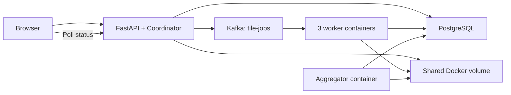
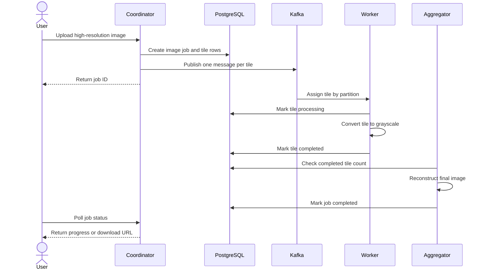
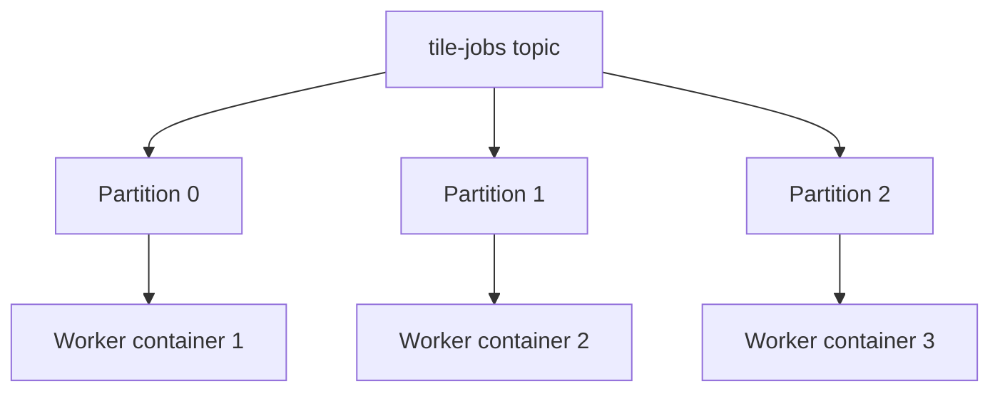
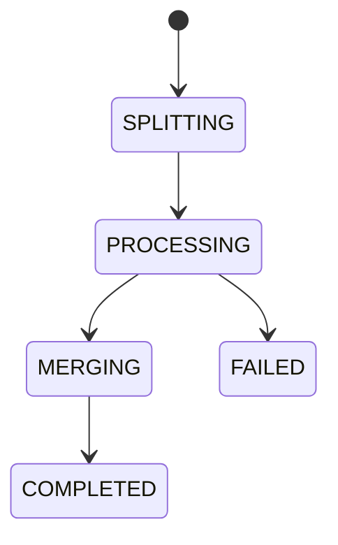

# Distributed Image Processing Architecture

## 1. High-level architecture



All components run as Docker containers on one machine. The system uses distributed components and parallel workers, but it does not claim a multi-node deployment.

## 2. Runtime containers

| Container | Count | Responsibility |
| --- | ---: | --- |
| API/coordinator | 1 | Upload, tile creation, Kafka production, status endpoints |
| Kafka | 1 | Partitioned tile-job distribution |
| PostgreSQL | 1 | Persistent job and tile state |
| Worker | 3 | Parallel grayscale tile processing |
| Aggregator | 1 | Detect completion and reconstruct final image |

The API, workers, and aggregator use the same application repository.

## 3. Upload and processing flow



## 4. Tile partitioning

For an image with width `W`, height `H`, and tile size `T = 512`:

```text
columns = ceil(W / T)
rows    = ceil(H / T)
tiles   = rows * columns
```

Each tile stores:

- `tile_index`
- `x` and `y` coordinates
- actual `width` and `height`
- input and output paths

Right and bottom edge tiles may be smaller than 512 pixels. The aggregator uses the recorded coordinates and sizes without resizing them.

## 5. Kafka distribution



- Topic: `tile-jobs`
- Partitions: 3
- Consumer group: `tile-workers`
- Message key: `tile_id`
- Auto-commit: disabled

Kafka assigns partitions to available workers. If one worker stops, Kafka reassigns its partition to another consumer in the same group.

## 6. Worker lifecycle

```text
Receive message
    -> Load tile row
    -> If already completed, commit and skip
    -> Mark processing
    -> Open input tile
    -> Convert to grayscale
    -> Save deterministic output
    -> Mark completed
    -> Commit Kafka offset
```

On a processing error, retry at most three times. After the final attempt, mark the tile failed and commit the message so it does not block the partition forever.

## 7. Aggregation

One aggregator container polls PostgreSQL for image jobs with status `PROCESSING`.

For each job:

1. If any tile is `FAILED`, mark the job `FAILED`.
2. If completed tiles are fewer than total tiles, wait.
3. If every tile is completed, mark the job `MERGING`.
4. Create a blank grayscale image using the original dimensions.
5. Load tiles ordered by `tile_index`.
6. Paste each tile at its stored `(x, y)` coordinate.
7. Save the final image.
8. Mark the job `COMPLETED`.

Only one aggregator container runs, which avoids competing merge operations in this version.

## 8. Persistent state

PostgreSQL is the source of truth:



The browser calculates progress from completed tile rows:

```text
progress = completed_tiles / total_tiles * 100
```

## 9. Storage layout

```text
storage/
  originals/{job_id}.{extension}
  jobs/{job_id}/input/{tile_index}.png
  jobs/{job_id}/output/{tile_index}.png
  final/{job_id}.png
```

Use UUID job identifiers and integer tile indexes. File-serving endpoints must resolve paths inside the storage root and reject path traversal.

## 10. Reliability boundary

This version provides:

- Kafka consumer-group rebalancing
- manual offset commits
- deterministic output paths
- completed-tile checks for redelivery
- three bounded processing attempts
- PostgreSQL-persisted progress

This version does not provide:

- multi-machine availability
- replicated Kafka or PostgreSQL
- exactly-once processing
- disaster recovery
- Kubernetes self-healing

## 11. Deployment

Docker Compose runs:

```text
api
kafka
postgres
worker (scaled to 3)
aggregator
```

The API, workers, and aggregator mount the same named storage volume and share one internal Docker network.

Kubernetes is not required or used.

