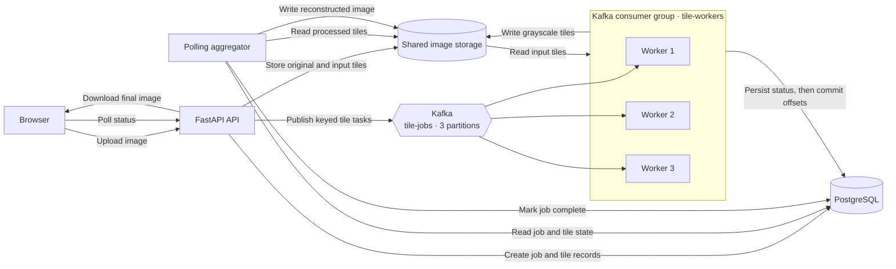

# Distributed Image Processing System

[](https://github.com/rajeev8008/Distributed-Image-Processing-System/actions/workflows/ci.yml)

An event-driven image-processing pipeline that partitions high-resolution images into independent tiles, distributes them across parallel workers through Apache Kafka, and reconstructs the processed results using coordinate-based aggregation.

The system uses Kafka consumer groups for load-balanced task execution, PostgreSQL for durable job tracking, and idempotent workers with manual offset commits for safe message redelivery.

## Results

On a 67.1-megapixel image divided into 256 tiles:

- Three workers reduced end-to-end runtime from 30.792s to 24.626s—a 20.02% improvement.
- Work was balanced across workers at 85, 82, and 89 tiles.
- All Kafka partitions finished with zero consumer lag.
- The reconstructed output matched whole-image processing exactly.

## Architecture

1. FastAPI validates the uploaded image and creates a processing job.
2. The coordinator divides the image into 512 × 512 tiles.
3. Each tile is published as an independent Kafka task.
4. Kafka consumer groups distribute tiles across parallel workers.
5. Workers process tiles independently and persist their results.
6. The aggregator reconstructs the final image using stored coordinates.
7. PostgreSQL maintains durable job and tile state throughout the workflow.



## Technology

- Python 3.12, FastAPI, and Uvicorn
- Apache Kafka and `confluent-kafka`
- PostgreSQL, SQLAlchemy, and Alembic
- Pillow
- Jinja2 and vanilla JavaScript
- Docker Compose
- pytest

## Run locally

Docker with Docker Compose is required.

```powershell
$env:POSTGRES_PASSWORD = Read-Host "PostgreSQL password"
docker compose up --build -d --scale worker=3
docker compose ps
docker compose logs -f worker aggregator
```

Open <http://127.0.0.1:8000>. Stop any separately running Uvicorn process first if it already uses port 8000.

To stop the application without deleting its volumes:

```powershell
docker compose down
```

## API

| Method | Endpoint | Purpose |
| --- | --- | --- |
| `GET` | `/` | Upload page |
| `POST` | `/jobs` | Validate, split, store, and queue an image |
| `GET` | `/jobs/{job_id}` | Job progress and tile counts |
| `GET` | `/jobs/{job_id}/view` | Browser status page |
| `GET` | `/jobs/{job_id}/download` | Completed grayscale image |
| `GET` | `/health` | API and database health |

## Reliability

- Database rows are created before Kafka messages are published.
- Image bytes remain in shared storage and never pass through Kafka.
- Workers persist each outcome before manually committing its Kafka offset.
- Completed tiles are skipped when messages are redelivered.
- Tile outputs use deterministic filenames.
- Failed processing is attempted at most three times.
- Kafka reassigns partitions when a worker stops.
- PostgreSQL preserves job progress across container restarts.

## Tests

Install the pinned dependencies, then run the isolated unit suite:

```powershell
python -m pip install -r requirements.txt
python -m pytest tests/unit -q --basetemp=.test-unit-temp -p no:cacheprovider
```

The unit tests cover image validation, exact and edge tile dimensions, coordinate-based out-of-order reconstruction, pixel equality, deterministic paths, state changes, bounded retries, and idempotent redelivery.

Integration tests require Docker. They start only PostgreSQL and Kafka in an isolated Compose project:

```powershell
$env:POSTGRES_PASSWORD = [guid]::NewGuid().ToString("N")
docker compose -p dips-integration up -d --wait postgres kafka topic-init
docker compose -p dips-integration run --rm --build `
  -e TEST_DATABASE_URL="postgresql+psycopg://image_app:$env:POSTGRES_PASSWORD@postgres:5432/image_processing" `
  -e TEST_KAFKA_BOOTSTRAP_SERVERS=kafka:9092 `
  api python -m pytest tests/integration -q -p no:cacheprovider
docker compose -p dips-integration down -v --remove-orphans
```

The end-to-end test creates and removes its own uniquely named Compose project. It launches three workers, uploads a deterministic image, downloads the result, checks every pixel, and verifies Kafka lag:

```powershell
python -m pytest tests/e2e -q --basetemp=.test-e2e-temp -p no:cacheprovider
```

GitHub Actions runs these correctness suites for pull requests targeting `main` and pushes to `main`. On failure it collects Compose logs, and its cleanup step always removes CI containers and volumes.

The `8192 × 8192` benchmark below is deliberately separate from pytest and CI.

## Reproduce the benchmark

Use the same source image for both runs and wait for Kafka to finish rebalancing after changing the worker count.

```powershell
docker compose up -d --scale worker=1 worker
python scripts/benchmark.py path\to\image.png --workers 1

docker compose up -d --scale worker=3 worker
python scripts/benchmark.py path\to\image.png --workers 3
```

The runner reports the source SHA-256, resolution, megapixels, tile count, runtime, throughput, and output correctness as JSON. The results above include upload, splitting, Kafka processing, aggregation, polling, and download verification; they are measured local results, not production-performance claims.

## Author

Developed by **K Rajeev**.

## License

[MIT](LICENSE)
